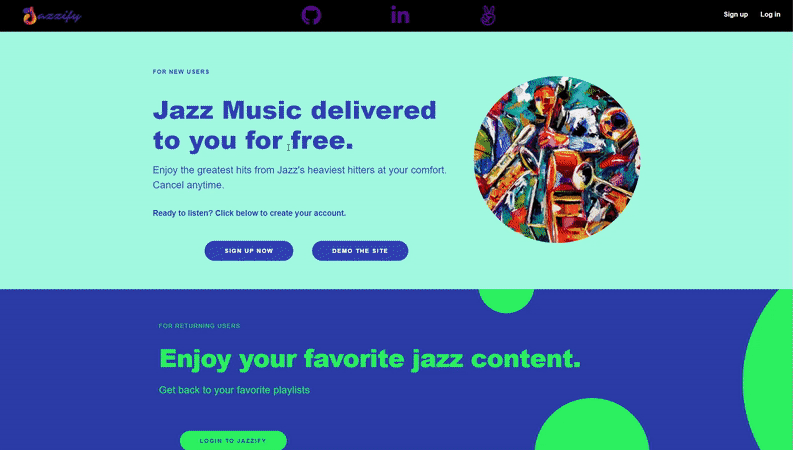

# Jazzify

<!-- Insert Usage GIF here -->

## Brief Introduction

Jazzify is a website for jazzheads to listen to a privately selected library of all time jazz greats.

All music is sourced from publicly available libraries and collections under: 

<a href="https://archive.org/" target="_top">Internet Archive Website</a>

# Table of contents

- [Jazzify](#Jazzify)
- [Brief Description](#brief-introduction)
- [Table of contents](#table-of-contents)
- [Live Link](#live-link)
- [Technologies](#technologies)
    - [Backend](#backend)
    - [Frontend](#frontend)
    - [Hosting](#hosting)
- [Features](#features)

## [Live Link](**https://jazzify-aa.herokuapp.com/**)

<a href="https://jazzify-aa.herokuapp.com/" target="_top">Jazzify Website</a>

<!-- Insert Usage GIF here -->

## Technologies

Jazzify is built using the following stack & libraries:

### **Backend**
1. _Sequelize_
   * Sequelize is a promise-based Node.js ORM for Postgres, MySQL, MariaDB, SQLite and Microsoft SQL Server. It features solid transaction support, relations, eager and lazy loading, read replication and more.
2. _PostgreSQL_
   * PostgreSQL is a relational database management system emphasizing extensibility and SQL compliance.
3. _Python_
   * web applications can send and retrieve data from a server asynchronously without interfering with the display and behaviour of the existing page.
4. Internet Archive API
   * The Internet Archive is an American digital library with the stated mission of "universal access to all knowledge". It provides free public access to collections of digitized materials, including websites, software applications/games, music, movies/videos, moving images, and millions of books. This is the source of the media files.

### **Frontend**

1. _Javascript_
2. _React.js_
   * React is a declarative, efficient, and flexible JavaScript library for building user interfaces. It lets you compose complex UIs from small and isolated pieces of code called “components”.
3. CSS
   * Cascading Style Sheets (CSS) is a style sheet language used for describing the presentation of a document written in a markup language.
### **Hosting**
1. Heroku
   * Heroku is a platform as a service that enables developers to build, run, and operate applications entirely in the cloud.

## Features

Please take a look at our Wiki for a full list of features, and upcoming features

<a href="https://github.com/miguelalvinflores/jazzify/wiki" target="_top">Jazzify Wiki</a>

<!-- # Footer -->
[(Back to top)](#table-of-contents)

Leave a star in GitHub and share this guide if you found this helpful or interesting.
